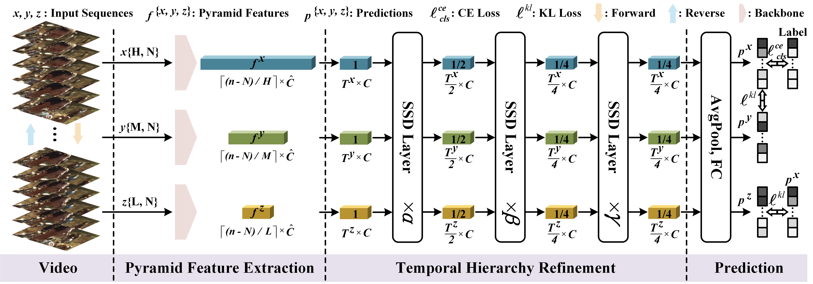
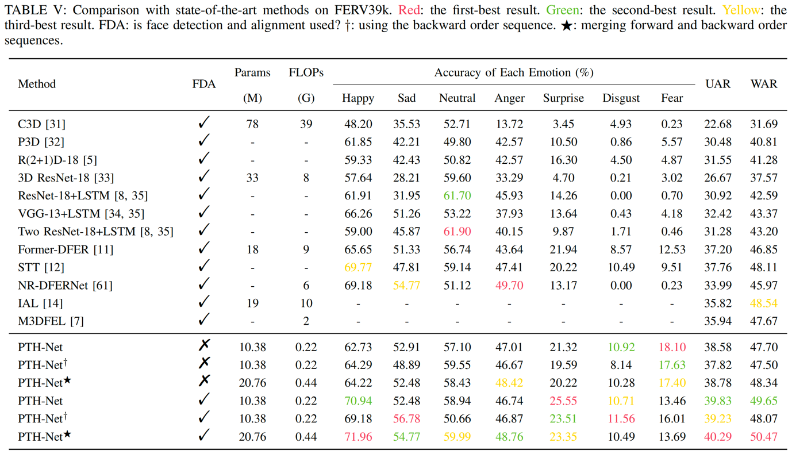
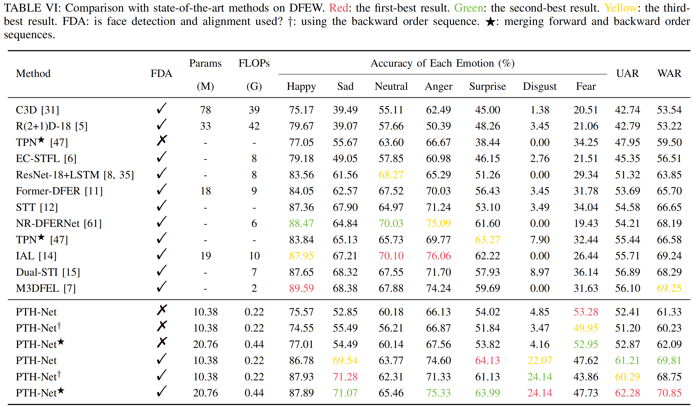

# PTH-Net: Dynamic Facial Expression Recognition without Face Detection and Alignment
This is an official implementation in PyTorch of PTH-Net. Our paper is available at [https://ieeexplore.ieee.org/abstract/document/10770138](https://ieeexplore.ieee.org/abstract/document/10770138)



> The code is modified from [Former-DFER](https://github.com/zengqunzhao/Former-DFER).

## Updates
- (February 20th, 2025) The complete FERv39k dataset after feature extraction using VideoMAE v2 has been re shared with Google Drive.
- (February 19th, 2025) Detected that the compressed file of the provided dataset is damaged and is currently being processed.
- (November, 2024) Our PTH-Net is accepted for publication in the IEEE Transactions on Image Processing (TIP).
- (July, 2024) We released PTH-Net training and inference code for the FERV39k dataset.

## Abstract
Pyramid Temporal Hierarchy Network (PTH-Net) is a new paradigm for dynamic facial expression recognition, applied directly to raw videos without face detection and alignment.
Unlike the traditional paradigm, which extracts facial regions before recognition and overlooks valuable information like body movements, 
PTH-Net preserves more critical information by distinguishing backgrounds and subjects (human bodies) at the feature level, and offers greater flexibility as an end-to-end network.
Specifically, PTH-Net utilizes a pre-trained backbone to extract multiple general features of video understanding at various temporal frequencies, forming a temporal feature pyramid. 
It then refines emotion information through temporal hierarchy refinement—achieved via differentiated sharing and downsampling—under the supervision of multiple receptive fields 
with expression temporal-frequency invariance. Additionally, PTH-Net features an efficient Scalable Semantic Distinction layer that enhances feature discrimination and dynamically 
adjusts feature relevance to better distinguish between target and non-target expressions in the video.} Notably, PTH-Net can achieve more comprehensive and in-depth understanding 
by merging knowledge from both forward and backward video sequences. Extensive experiments demonstrate that PTH-Net performs excellently in eight challenging benchmarks, 
with lower computational costs compared to previous methods.

## Summary

[//]: # (- First purely anchor-free framework for temporal action detection task.)

[//]: # (- Fully end-to-end method using frames as input rather then features.)

[//]: # (- Saliency-based refinement module to gather more valuable boundary features.)

[//]: # (- Boundary consistency learning to make sure our model can find the accurate boundary.)

## Performance
We compare our method against others on eight benchmark datasets, i.e., [FERV39k](https://github.com/wangyanckxx/FERV39k) and [DFEW](https://dfew-dataset.github.io/) in terms of unweighted average recall (UAR) and weighted average recall (WAR):




## Getting Started

### Environment
OS: Ubuntu 18.04.5 LTS 

Python: 3.7

Pytorch: 1.11.0

CUDA: 11.2

GPU: A NVIDIA V100

### Setup
```shell script
$ git clone git@github.com:lm495455/PTH-Net.git
$ cd PTH-Net
$ conda create -n env_name python=3.7
$ conda activate env_name
$ pip install -r requirements.txt
```
### Data Preparation
- **FERV39k data:**
1. Download pre-processed by VideoMAE V2 npy data: [\[Google Drive\]](https://drive.google.com/file/d/1hi-g51f09JfQAZndvdkf7Ac3NCryELOx/view?usp=drive_link)[\[115\]](https://115.com/s/swzjtf233kn?password=c455&#get_features)
2. Unzip the npy data to `./get_features/`


**If you want to generate npy data by yourself, please refer to the following guidelines:**

- **Cropped face and original video:**
1. To construct npy inputs, please download the official data of FERV39k.  
According to [official](https://github.com/wangyanckxx/FERV39k) requirements, you can obtain the data address.   
Download Link: [https://drive.google.com/drive/folders/1NFMBVJXVZ5Vej-xWqWz2xgbh-pbh7oMt?usp=sharing](https://drive.google.com/drive/folders/1NFMBVJXVZ5Vej-xWqWz2xgbh-pbh7oMt?usp=sharing)  
  
2. Unzip Cropped faces `2_ClipforFaceCrop.zip` and original videos `0_7_labelClips.zip`

- **VideoMAE V2 video features generation manually:**
1. Please refer to the official instructions of VideoMAE V2:  [https://github.com/OpenGVLab/VideoMAEv2](https://github.com/OpenGVLab/VideoMAEv2)
2. The pre-trained model file we used is `vit_g_hybrid_pt_1200e_k710_ft.pth`, fill in the [official file](https://docs.google.com/forms/d/e/1FAIpQLSd1SjKMtD8piL9uxGEUwicerxd46bs12QojQt92rzalnoI3JA/viewform?usp=sf_link) to obtain it, 
download it to `VideoMAEv2/pre_models/vit_g_hybrid_pt_1200e_k710_ft.pth`.
3. The script we used to extract video features is `extract_FERv39k_feature.py`: [\[Google Drive\]](https://drive.google.com/file/d/1F_wjo7CpbZi-6zA4nv_dCOnHgV1Y7hPo/view?usp=drive_link)[\[115\]](https://115.com/s/swzjti333kn?password=c390&#extract_feature.zip), download it to `VideoMAEv2/extract_FERv39k_feature.py`
4. Check and run the script: `cd VideoMAEv2; python extract_FERv39k_feature.py`

### Inference
We provide the pretrained models contain the forward sequence model and the backward sequence model for FERV39k dataset:
[\[Google Drive\]](https://drive.google.com/file/d/1BdKpVtTkvSGyjuQ8Zz4s4CKGb5cQhPuh/view?usp=drive_link)
[\[Baidu\]](https://pan.baidu.com/s/1Zi5a1hDaOhfDSJhU7KZRtw?pwd=ke5g)
[\[115\]](https://115.com/s/swzjtob33kn?password=x615&#FERv39k.zip). Download to `./best_model/`
```shell
# run forward model without face detection and alignment
python combine_test.py --resume_norm=best_model/FERV39k/FERV39k-ori-model_best.pth --num_class=7 --is_face=False 

# run combine (forward + backward) model without face detection and alignment
python combine_test.py --resume_norm=best_model/FERV39k/FERV39k-ori-model_best.pth --resume_rv=best_model/FERV39k/FERV39k-ori-rv-model_best.pth --num_class=7 --is_face=False --mu=0.7

# run combine (forward + backward) model with face detection and alignment
python combine_test.py --resume_norm=best_model/FERV39k/FERV39k-model_best.pth --resume_rv=best_model/FERV39k/FERV39k-rv-model_best.pth --num_class=7 --is_face=True --mu=0.7
```

### Training
```shell script
# train the forward model without face detection and alignment
python main.py epochs=20 --bz=32 --lr=0.005 --gamma=0.1 --mil=[5, 10, 15] --dataset= 'FERv39k' --data_mode='norm' --num_class=7 --is_face=False

# train the backward model without face detection and alignment
python main.py epochs=20 --bz=32 --lr=0.005 --gamma=0.1 --mil=[5, 10, 15] --dataset= 'FERv39k' --data_mode='rv' --num_class=7 --is_face=False
```
### 

## Citation
If you find this project useful for your research, please use the following entry.
```
@article{Li2024PTH_Net,
  title={PTH-Net: Dynamic Facial Expression Recognition without Face Detection and Alignment},
  author={Min Li, Xiaoqin Zhang, Tangfei Liao, Sheng Lin, and Guobao Xiao},
  journal={IEEE Transactions on Image Processing},
  year={2024}
}
```
